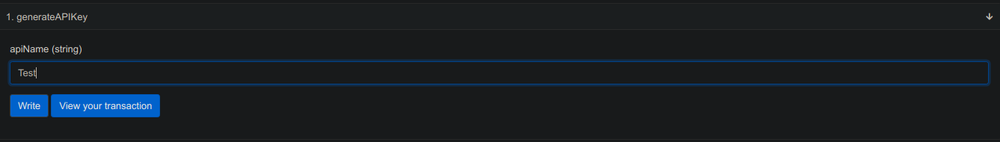

## Sushi API

Contract for Tracking and Generating API Key for Sushi.
It tracks the Volume in both ETH Value and Source Token Value.

# TODO:

[X] Additional Mapping to Track the Volume of each Transaction in the Target Token Value Alongside Target Token Ethereum's Value.

[] Web Interface for Statistics & API Management

[] SubGraph for API Volumes and Swaps

# Deployed Address

Kovan: <a href="https://kovan.etherscan.io/address/0xD2A5c881D06083d275251299C3AB4ce822A7A0D5">0xD2A5c881D06083d275251299C3AB4ce822A7A0D5</a>

Transaction Example:

API Volume Data Example:

Generate API Example:

